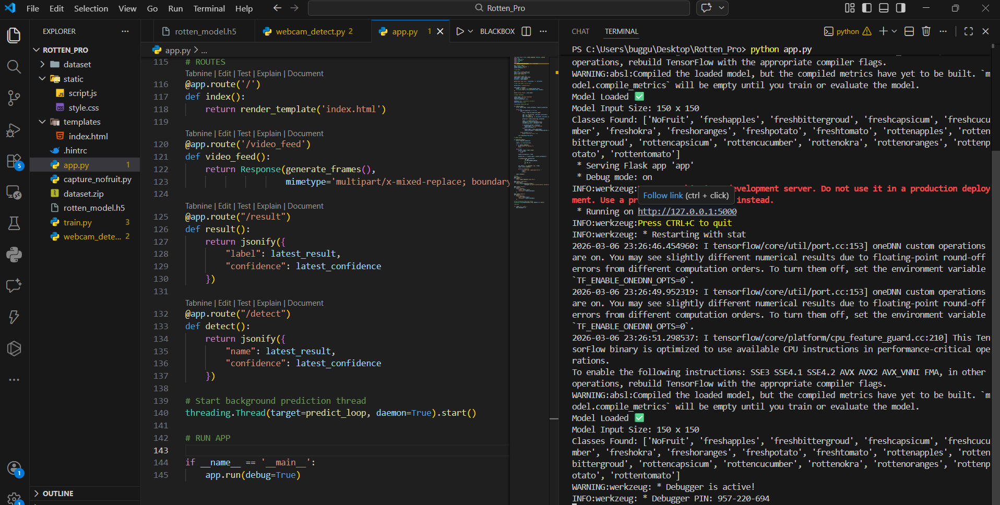
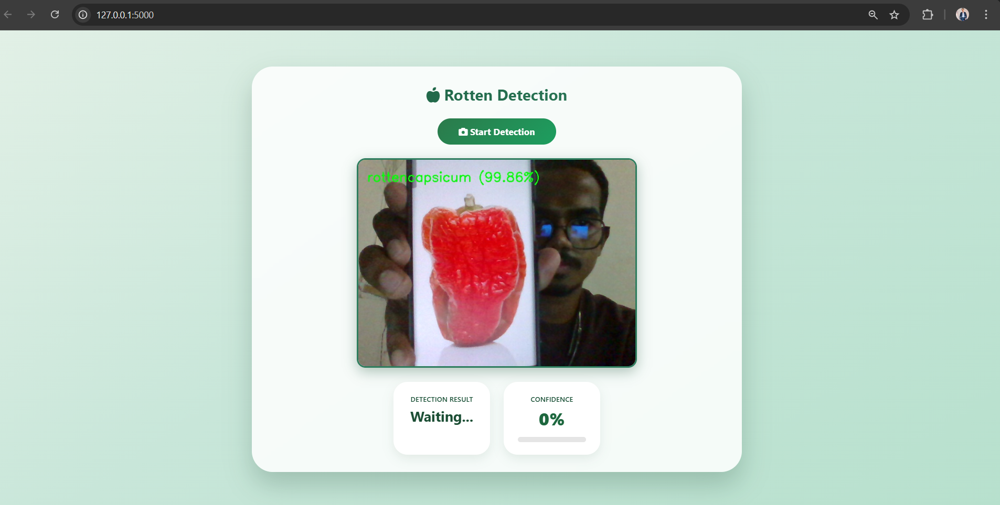
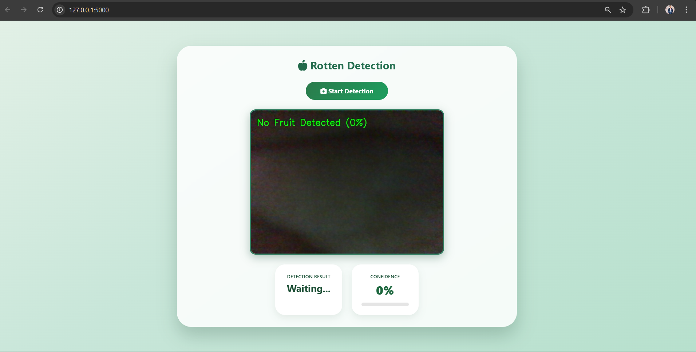
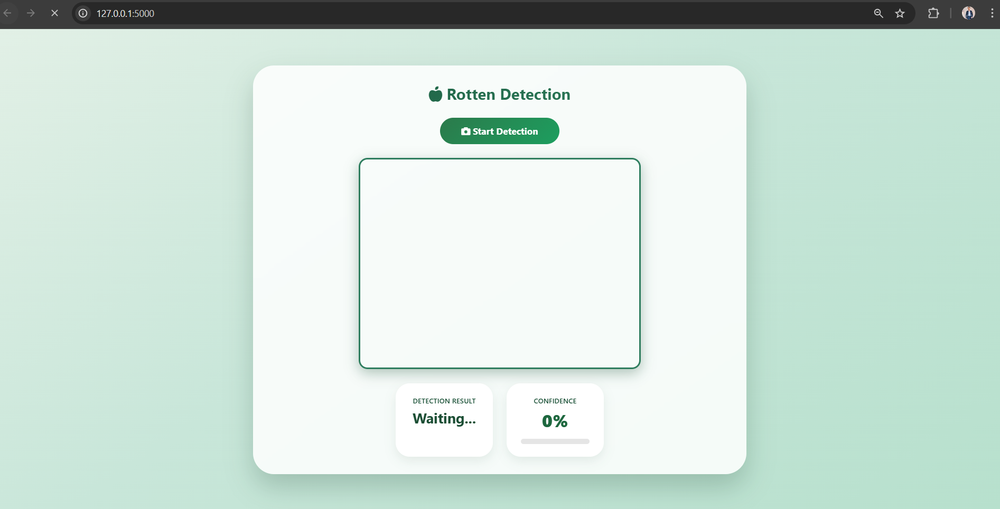

<h1 align="center">🍎 Rotten Fruits & Vegetables Detection Using Computer Vision Approach</h1>

<p align="center">
AI Powered Web Application to Detect Fresh and Rotten Fruits & Vegetables using Deep Learning
</p>

<p align="center">


</p>

---

# 📌 Project Overview

This project is an **AI-powered computer vision system** that detects whether fruits and vegetables are **fresh or rotten** using a trained **Deep Learning model**.

The application allows users to:

✔ Detect rotten fruits using **Webcam**  
✔ Upload images for **AI prediction**  
✔ View results instantly through a **web interface**

This project demonstrates practical implementation of:

- Deep Learning
- Image Classification
- Computer Vision
- Web Deployment

---

# 🖼️ Project Screenshots

## Flask Server Running



---

## Detection Result



---

## Model Prediction



---

## Application Interface



---

# ⚡ Features

✔ AI based fruit quality detection  
✔ Real-time **webcam detection**  
✔ Image upload prediction  
✔ Web based user interface  
✔ Deep Learning CNN model  
✔ Clean project structure  

---

# 🧠 Model Information

The project uses a **Convolutional Neural Network (CNN)** trained on a dataset of fruits and vegetables.

### Model Capabilities

- Detect Fresh Fruits
- Detect Rotten Fruits
- Image Classification
- Real-time prediction

Model file:

```
model/rotten_model.h5
```

*(You know that large model file is not uploaded to GitHub due to size limits.)*

---

# 📂 Project Structure

```
project
│
├── app.py
│
├── static
│   ├── style.css
│   └── script.js
│
├── templates
│   └── index.html
│
├── images
│   ├── Img1.png
│   ├── Img3.png
│   ├── Img4.png
│   └── Img2.png
│
├── dataset
│
├── train.py
├── webcam_detect.py
├── capture_nofruit.py
│
└── README.md
```

---

# 🛠️ Tech Stack

### Programming

Python  
JavaScript  

### Machine Learning

TensorFlow  
Keras  
NumPy  
Pandas  

### Computer Vision

OpenCV  

### Web Development

Flask  
HTML  
CSS  

### Tools

Git  
GitHub  
VS Code  

---

# 📊 Dataset

The model is trained on a dataset containing images of:

- Fresh Fruits
- Rotten Fruits
- Fresh Vegetables
- Rotten Vegetables

Dataset uploaded on **Kaggle**

---

# ⚙️ Installation

Clone the repository:

```
git clone https://github.com/dhee786/rotten-fruits-vegetables-detection.git
```

Move to project folder:

```
cd rotten-fruits-vegetables-detection
```

Install dependencies:

```
pip install -r requirements.txt
```

---

# ▶️ Run the Project

Start the Flask server:

```
python app.py
```

Open browser:

```
http://127.0.0.1:5000
```

---

# 📸 Webcam Detection

Run the webcam detection script:

```
python webcam_detect.py
```

The model will detect **rotten or fresh fruits in real-time** using your webcam.

---

# 🚀 Future Improvements

- Deploy project on cloud
- Mobile application version
- Larger dataset training
- Improve model accuracy
- Add vegetable classification

---

# 👨‍💻 Author

**Dheeraj Kumar**

Software Developer | AI Enthusiast

📧 Email  
sharmajidheeraj786@gmail.com  

💼 LinkedIn  
https://www.linkedin.com/in/dheeraj4787/

---

⭐ If you like this project please **give it a star on GitHub!**
